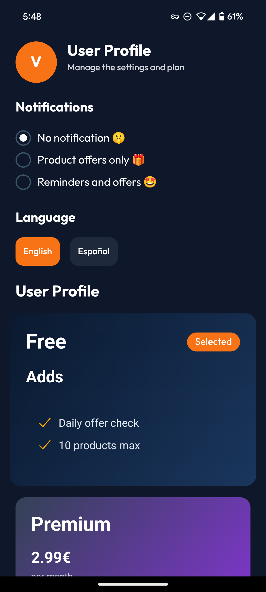

# OfferAlert Mobile


OfferAlert is a mobile application that helps you track prices and receive notifications for your favorite products. Simply share the product URL, and we'll notify you when the price drops or a special offer becomes available.

## Features

- **Product Tracking:** Add products from any online store by sharing the URL.
- **Real-time Notifications:** Receive push notifications when a price changes.
- **User Authentication:** Secure login with email, Google, or Apple.
- **Multi-language Support:** Available in English and Spanish.
- **User Profile:** Manage your notification preferences and subscription plan.
- **Modern Interface:** A clean and intuitive user interface built with NativeWind.

## Screenshots

| Welcome Screen | Login Screen | Principal Screen | User Profile |
| :---: | :---: | :---: | :---: |
|  |  |  |  |

## Technologies Used

- **Framework:** React Native with Expo
- **Language:** TypeScript
- **Styling:** NativeWind (Tailwind CSS for React Native)
- **Navigation:** React Navigation
- **Internationalization:** i18next
- **HTTP Client:** Axios
- **Local Storage:** AsyncStorage

## Backend

This application connects to a backend server for web scraping and other services. The backend is a separate project, which you can find here: [OfferAlertBackend](https://github.com/victorrmc/OfferAlertBackend)

## Installation

1.  **Clone the repository:**
    ```bash
    git clone git@github.com:victorrmc/OfferAlertMobile.git
    ```
2.  **Navigate to the project directory:**
    ```bash
    cd OfferAlertMobile
    ```
3.  **Install dependencies:**
    ```bash
    npm install
    ```

## Available Scripts

- `npm start`: Runs the app in development mode with Expo Go.
- `npm run android`: Runs the app on a connected Android device or emulator.
- `npm run ios`: Runs the app on the iOS simulator.
- `npm run web`: Runs the app in a web browser.

## Project Structure

```
OfferAlertMobile/
├── assets/             # Images, icons, and other static assets
├── components/         # Reusable UI components
├── constants/          # Global constants
├── context/            # React context providers (e.g., AuthContext)
├── public/             # Publicly accessible files (fonts, images)
├── screens/            # Application screens
├── service/            # Services for authentication and web scraping
├── translations/       # Language files for i18n
└── utils/              # Utility functions
```
